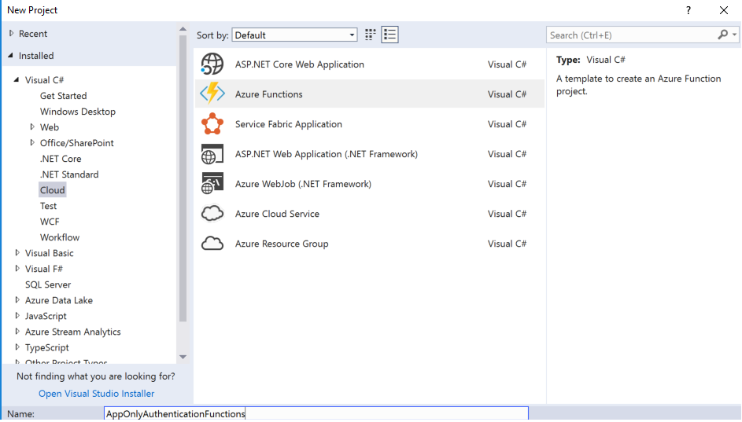
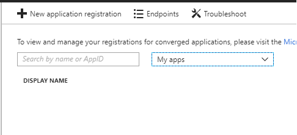
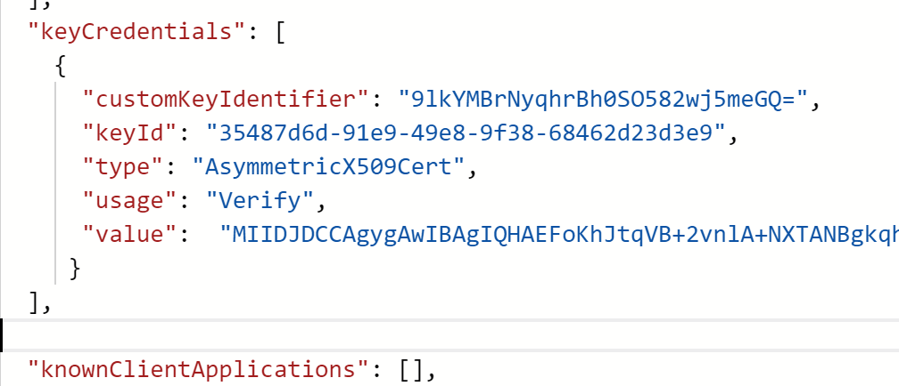

 
Azure functions are becomming more and more popular and they are perfect in combination with webhooks, storage queues and other scenarios your application may need. In this post i will talk about how to set up app only authentication using a certificate and an Azure Active Directory Application. So here we go.

Prerequisites

* Azure Function App and of course a storage account


## Create a visual studio 2017 Azure Functions Project


I will use v1 of the Azure Functions as I will use [SharePointPnPCoreOnline nuget package](http://https://github.com/SharePoint/PnP) and that does not support the .net core 2.0 yet. I will create an HTTP Trigger for this example. 


## We need a certificate. 
Unlike the Microsoft Graph, SharePoint needs a certificate if you want to gain Application Only access. Use the following powershell code to generate your certificate on your computer. It will output the Thumbprint of your certificate. Copy it and put it somewhere. We will need this in a bit. Keep your powershell session open we will need it in a bit. 

```Powershell
$keyName = "demokey.local"
#Create certificate
$newCert = New-SelfSignedCertificate -KeySpec Signature -certstorelocation cert:\CurrentUser\my -dnsname $keyName -NotAfter ((Get-Date).AddYears(10))
$newCert.Thumbprint
```

## Azure AD Application setup

### Creating and Configuring your application ###

Now login to your azure portal and click on your Azure Active Directory in the left menu


Next click on the App Registrations link in the next menu


Then Click on new application registration



Next fill in the information for your new application. The single sign-on url is not used so you can add whatever you want here.  


Now that we have an application we need to give it permissions to access SharePoint. Click on settings, Then Required Permissions, and finally click on the Add button under Required permissions


Select "Office 365 SharePoint Online" as your API


Under Select Permissions select the Application Permissions you need for your application. 


Once you have finished selecting your premissions click on Done. 
You should now have a screen similar to the below. **The last step is to click on the Grand Permissions button to finalize your changes. **


### Getting the applicaiton to trust your certificate 

Now your application has permissions to SharePoint. However we are not done yet. We need to let your application trust the certificate you created earlier. In order to do this we need to edit the Manifist of our application and update the keycredentials. 

So next thing we need to do is run the below PowerShell script. This will export the certificate to your computer and extract and format the data needed for your manifist. You may want to change the password to something better. Once you have run the script you should now have the keycredentials json in your clipboard

```powershell
# exports the key to your computer
$pwd = ConvertTo-SecureString -String "p@ssw0rd" -Force -AsPlainText # password is not important it is not stored later in azure or used
Export-PfxCertificate -cert ("cert:\CurrentUser\my\" + $newCert.Thumbprint) -FilePath ("c:\" + $keyName + ".pfx") -Password $pwd 
$pfxFilePath = "c:\" + $keyName + ".pfx"
$pwd = "p@ssw0rd"
$flag = [System.Security.Cryptography.X509Certificates.X509KeyStorageFlags]::Exportable 
$collection = New-Object System.Security.Cryptography.X509Certificates.X509Certificate2Collection  
$collection.Import($pfxFilePath, $pwd, $flag) 

# generate keyCredentials for your application Manifist. 
$rawCert = $collection.GetRawCertData()
$base64Cert = [System.Convert]::ToBase64String($rawCert)
$rawCertHash = $collection.GetCertHash()
$base64CertHash = [System.Convert]::ToBase64String($rawCertHash)
$KeyId = [System.Guid]::NewGuid().ToString()

$keyCredentials = 
'"keyCredentials": [
    {
      "customKeyIdentifier": "'+ $base64CertHash + '",
      "keyId": "' + $KeyId + '",
      "type": "AsymmetricX509Cert",
      "usage": "Verify",
      "value":  "' + $base64Cert + '"
     }
  ],'
$keyCredentials
$keyCredentials | clip.exe #copies to clipboard
```

Navigate back to your application and open the manifest. Find highlight the "keyCredentials": [], section and replace the contents from json generated from the PowerShell script. It should still be in your clipboard


It should now look like this. Click on save at the top of the blade. 



Your application is now ready. 

## The Code

Now go back to your Visual Studio project and add the SharePointPnPCoreOnline nuget package to your project. 

> If you get a Newtonsoft.Json error when installing the package, just install the Newtonsoft.Json nuget package version that is currently being used by the pnp package. You can find it in the error message. 


Next past the follwoing code in the Run Function. 

You will need to replace the following information

* thumbPrint : You should have this from when you created your certificate
* siteUrl : url of the site collection you would like to access
* tenant : your tenant 
* applicationId : this is the ID of the Azure Application you created earlier

Resolve any missing assemblies and press F5

```c#
log.Info("C# HTTP trigger function processed a request.");

string thumbPrint = "702221505ED4B17B928844AF6B694E4BE853A6FF";
string siteUrl = "https://zalodev.sharepoint.com/sites/david";
string tenant = "zalodev.onmicrosoft.com";
string applicationID = "b73a2784-17dd-4040-ab28-b00504ab0526";

X509Certificate2 cert2 = null;
X509Store store = new X509Store(StoreName.My, StoreLocation.CurrentUser);
try
{
    store.Open(OpenFlags.ReadOnly);

    var col = store.Certificates.Find(X509FindType.FindByThumbprint, thumbprint, false);

    if (col == null || col.Count == 0)
    {

        return null;
    }
    cert2 = col[0];

}
catch (Exception ex)
{
    throw ex;
}
finally
{
    store.Close();
}

OfficeDevPnP.Core.AuthenticationManager authmanager = new OfficeDevPnP.Core.AuthenticationManager();


using (ClientContext ctx = authmanager.GetAzureADAppOnlyAuthenticatedContext(siteUrl, applicationID, tenant, cert2))
{
    ctx.Load(ctx.Web);
    ctx.ExecuteQuery();
    log.Info("Your Site Name is: " + ctx.Web.Title);
    return req.CreateResponse(HttpStatusCode.OK, $"Your Site Name is: " + ctx.Web.Title);
}

```


You should now see a message that is showing the title of your site. Your code is now talking to SharePoint


If you want to run your code on another developer machine. Take the certificate that was generated on your c: and import it on your other machine. 

## Get it working in your Azure Function

You should create and configure an Azure Function in your portal. Or you can create one when you publish your Function.

Comming Soon