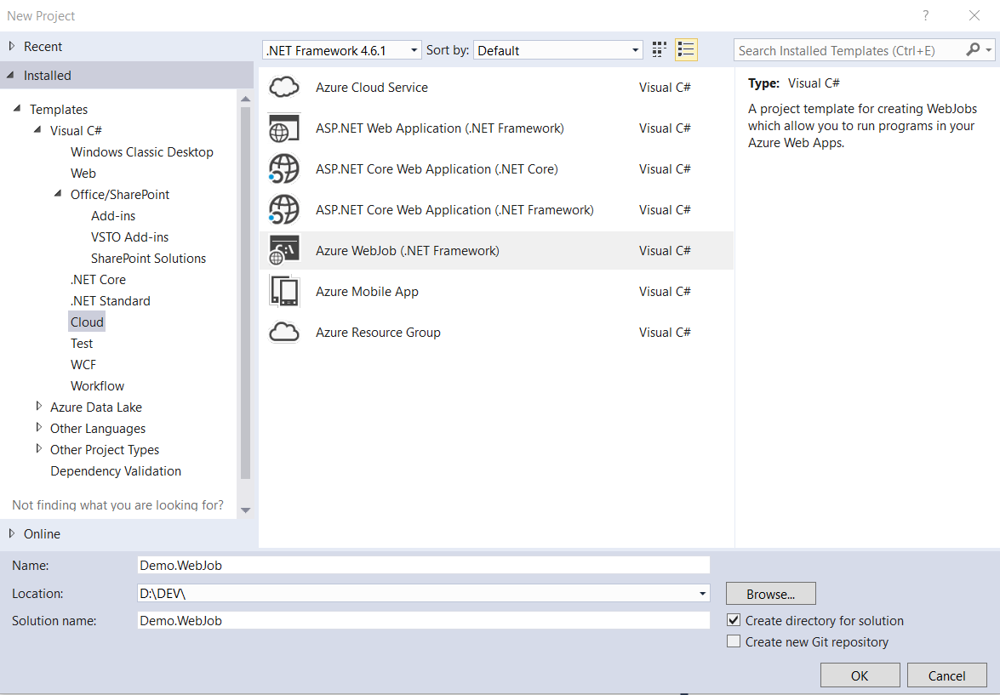
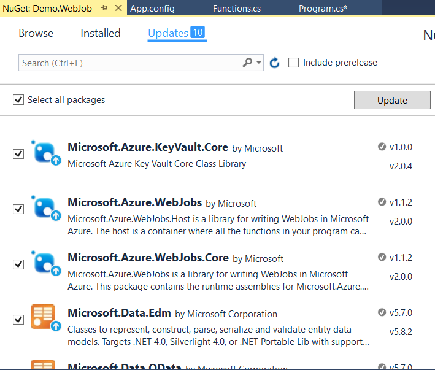
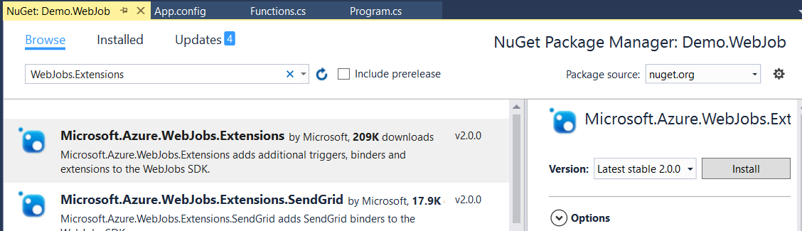
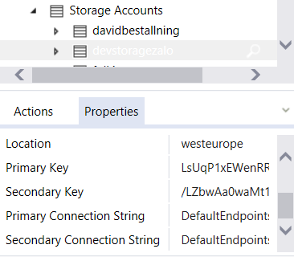
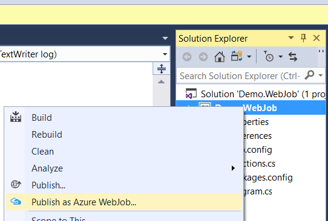

Azure web jobs are great ways to run scheduled tasks or handle events using storage queues, in the cloud. 

In this article I will talk about how to make use of the WebJobs.Extensions package to create scheduled tasks and make use of a storage queue to run asynchronous operations in the cloud. Of if you want synchronous operations

## Creating your WebJob project

First of all, make sure you have the latest azure sdk installed for your version of visual studio. In this article I will be using Visual Studio 2017
https://azure.microsoft.com/en-us/downloads/
 
#### 1. Create a new Azure WebJob project

Under the "Cloud" category you will find the Azure WebJob project. Give your project a name and press OK.


#### 2. Update your NuGet packages.

Make sure your packages are up-to-date. This is "almost" always a good idea when starting a new project. 

To get to the update screen right click on the webjob project and select "Manage NuGet pacckages"



#### 3. Install Microsoft.Azure.WebJobs.Extensions

While your in the NuGet manager Browse for the webjob.extensions package and install the latest version. 



This WebJobs extension package adds loads of extra functionality to your WebJob project. To find out more visit the following link 

https://github.com/Azure/azure-webjobs-sdk-extensions

## WebJob Configuration

There are two areas we will need to configure before we start creating our functions. First it will be the app.config and secondly will be our project.cs file where the JobHostConfiguration is used.

#### 1. App.Config storage queue connection strings

In your app.config you will find the two connectionstrings that you will add your storage key connection string. 
```xml
  <connectionStrings>
    <add name="AzureWebJobsDashboard" connectionString="" />
    <add name="AzureWebJobsStorage" connectionString="" />
  </connectionStrings>
```

The easiest place to get the storage queue connection string is to login to your azure subscription using the cloud explorer in visual studio and grabbing the Primary Connection String from the properties of your storage account. Add this connection string to both connections strings found in your App.Config



#### 2. JobHostConfiguration in program.cs 

In your program.cs file you have the entry point of your program as WebJob projects are actually just console applications.

In the file you will find an instance of the JobHostConfiguration object. This object is used to configure the properties of your WebJob. My configuration looks like the below

```c#
 static void Main()
{
    var config = new JobHostConfiguration();
    config.UseTimers();
    config.Queues.MaxDequeueCount = 2;
    config.Queues.MaxPollingInterval = TimeSpan.FromSeconds(4);
    config.Queues.BatchSize = 2;
    var host = new JobHost(config);
    host.RunAndBlock();
}
```

So lets break down the items into pieces

```c#
config.UseTimers();
```
The config.UserTimers(); allows us to use a timer trigger in our functions. More about this later. 
```c#
config.Queues.MaxDequeueCount = 2;
```
The MaxDequeueCount is the number of times your function will try process a message if it errors out. If your code throws an exception it will try process the message again. After two tries in this case the message will be moved to a poisoned queue. The Default value for this is 5.

An example of why we need this would be if you were calling another service in the cloud and something happened to the network or the service was temporary down. An exception would be thrown. The WebJob would then try again the process the same message and if the service was working or network was up again it would succeed. 
```c#
config.Queues.MaxPollingInterval = TimeSpan.FromSeconds(4);
```
MaxPollingInterval is the max amount of time the WebJob will check the queue. If the queue is empty the WebJob will start checking less frequently up to a max of 10 min. If of course this is not desirable you can change this setting like I have above so that the WebJob will check the queue maximum every 4 seconds. 

```c#
config.Queues.BatchSize = 2;
```

The BatchSize property is the amount of items your WebJob will process at the same time. The items will be processed asynchronously. So if there is 2 items in the queue they will be processed parallel. If you set this one to 1 then you are creating a Synchronous flow as it will only take one item out of the queue at a time. 

## The Functions 

In your project you will have a funtions.cs file. This is where you will place all your tasks. You will never call these functions from anywhere in your code but instead they will have a trigger that will fire off the function. I will explain two types: QueueTrigger and the TimerTrigger. There are more types and if you are interested go and visit https://github.com/Azure/azure-webjobs-sdk-extensions

#### 1. QueueTrigger
The QueueTrigger will be fired when it finds an item in the storage queue you specified. It is listening to the storage account that you specified in the connection strings in the app.config

```c#
public static void ProcessAQueue([QueueTrigger("acoolmessage")] string message, TextWriter log)
{
    Console.WriteLine("This should run every time there is a message in the queue");
    Console.WriteLine(message);

}
```

#### 2. TimerTrigger
The simplest way to use the TimerTrigger is to use a Cron expression to define the schedule for the function. You can also set up a custom schedule. See https://github.com/Azure/azure-webjobs-sdk-extensions for more information

See the following wikipedia article for more information about the Cron expression
https://en.wikipedia.org/wiki/Cron

```c#
public static void FiveSecondTask([TimerTrigger("*/5 *  * * * *")] TimerInfo timer)
{
    Console.WriteLine("This should run every 5 seconds");
}

```

## Publish To Azure
Last thing to do when you are happy with your WebJob and that is publish it to Azure. Just right click your project and click on Publish As Azure WebJob. You will need an Azure web app to host your webjob. Just import your publishing profile in the wizard and your good to go. 


