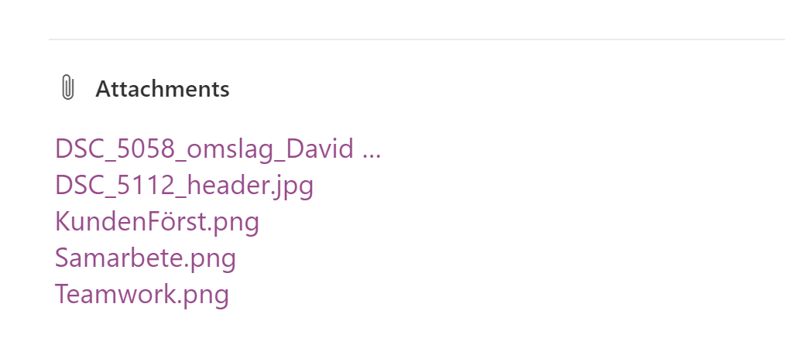

Ok so you need to create a function that returns image data from attachements connected to a list item in SharePoint. Or perhaps some other scenario




Lets start with a simple class to hold our data

```c#
public class Attachement    {

    public string Name { get; set; }

    public string Base64Image { get; set; }
}
```

Now the following function will loop through all attachements and return the name of the file and the base64 file contents. 

```c#
private  List<Attachement> GetAttachmentData(ListItem item)
{
    // get the context from the item object
    var ctx = item.Context as ClientContext;    


    var images = new List<Attachement>();

    // check to see if AttachmentFiles has been loaded. 
    if (item.IsObjectPropertyInstantiated("AttachmentFiles"))
    {

        foreach (var attch in item.AttachmentFiles)
        {
        
            var image = new Attachement();
            image.Name = attch.FileName;

            // Get File via its url
            var attachmentFile = ctx.Web.GetFileByServerRelativeUrl(attch.ServerRelativeUrl);
            var binaryData = attachmentFile.OpenBinaryStream();
            ctx.ExecuteQuery();

            // convert stream to base 64
            var mStream = new MemoryStream();
            if (binaryData != null)
            {
                binaryData.Value.CopyTo(mStream);
                byte[] bytes = mStream.ToArray();
                image.Base64Image = Convert.ToBase64String(bytes);
            }

            images.Add(image);

        }
    }

    return images;
}

```


Thats it. Dont forget to load the AttachmentFiles object before calling the function or load it inside the function. 


```c#
ctx.Load(item.AttachmentFiles);
ctx.ExecuteQueryRetry();
```


