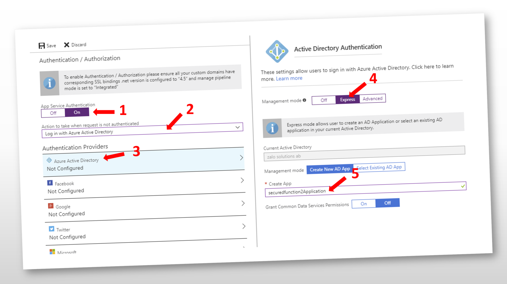
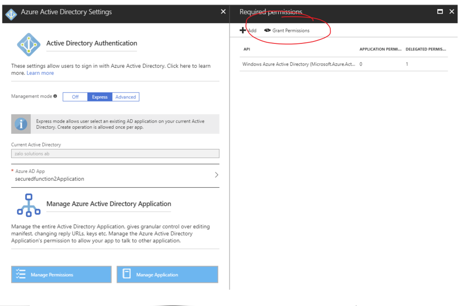
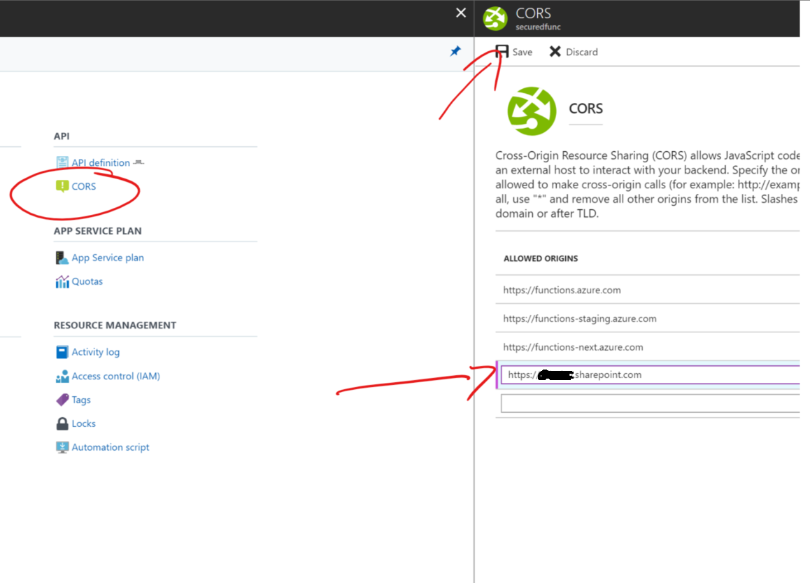
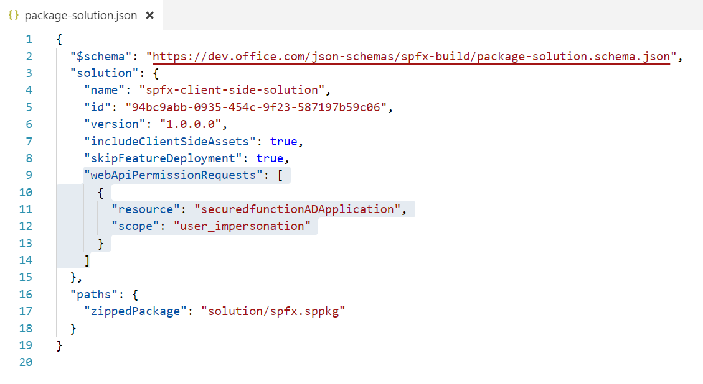
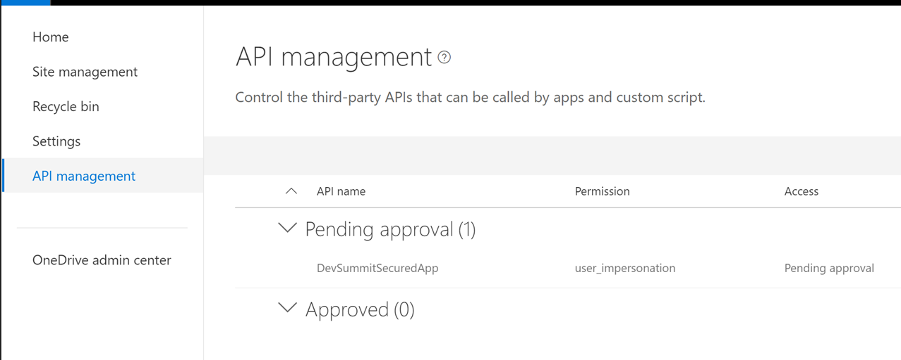
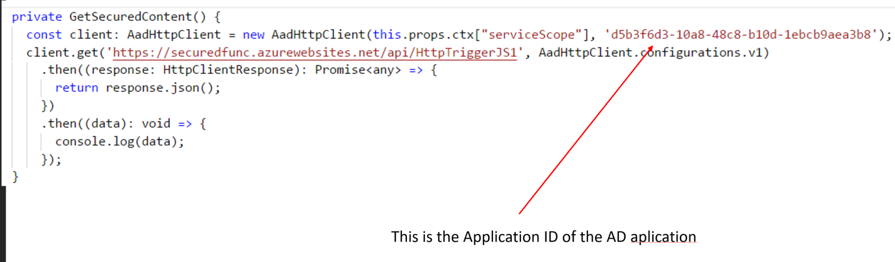

With the release of the 1.4.1 of the SharePoint Framework we now have the ability to easily call a secured Azure Function via a REST call from our SharePoint Framework webparts. You can do this by using the new AadHttpClient. Link to Documentation Below.
https://docs.microsoft.com/en-us/sharepoint/dev/spfx/use-aadhttpclient?WT.mc_id=DOP-MVP-5003345


## Why a secured function?
There is often times when we want to surface sensitive data into our office 365 tennant. Azure functions are great ways to deliver this data. Some scenarios might include:
* Run elevated code to run operations in SharePoint or Office 365 and expose the data via an http function
* Use a proxy function to exposing data from your internal network
* Obtain more control over the Microsoft Graph. You can alo set who can access the azure function to specific people or groups

## How to secure an azure function

1. In your Function App click on "Patrform features" and then "Authentication / Authorization"
2. Follow the steps below and press the save button. Your functions will then be secured via Azure Active Directory and have its own Application.

3. Once the Azure Application is complete you will want to navigate to its permissions and press the "Grant Permissions" as an administrator. This will pre-approve requests to the application and the users will not get any popups to consent to access their user Sign In and User profile.


Thats it.. Now when you add the function url into a browser you will have to log in if you want to access the information.

##How to call a secured function

Before you start make sure you have added your SharePoint Url to the CORS list in your functions app


Then its time to setup your SharePoint Framework project. First go to your package-solution.json file and add the following webApiPermissionRequests section to the file. The resource name will be the name of your Azure AD Application associated with your Function App. The scope you will just set to "user_impersonation" 


> You need to be running version 1.4.1 of the SharePoint Framework or later. 

The next step is to run "gulp package-solution" and upload the app package to the sharepoint app catalog. You need to do this even if you plan on only using the workbench as you will need to approve the access to the api in a later step.

Now that your app is added you need to approve it. Goto your sharepoint admin site https://[tenant]-admin.sharepoint.com and enter the new sharepoint admin center. 

> Note: At the time of writing you only have the new SharePoint Admin Center in first release tenants. 
> 

Now click on the "API management" link in the left menu. Find your application and approve it.



Now you can start coding. First add the following line to the top of your code file you are working in. 

```
import { AadHttpClient, HttpClientResponse } from '@microsoft/sp-http';
```

you can now make a call to your secured function api by using the following code. ctx is my WebPartContext object. At the time of writing I had to use ["serviceScope"] to access the property as the type definitions have not yet been updated. I guess that can happen when things are in preview. 

The Second parameter of the AadHttpClient will be the "Application Id" of your Azure AD Application.



You should now be able to test your webpart and see information from your function in the console window and can continue your development.


Below is the the code you can copy paste.

<script src="https://gist.github.com/spdavid/0cd562d26686fde08692745a921d3cbc.js"></script>

## Final Thoughts

Now that your function is secure and you can consume it within your webpart there are a few final things you should think about. 

First, find the AD application in the Azure Active Directory blade in Azure and then find your application under All applications. Click on properties.

You should set Visible to users to "No" so they dont see it as an available application. 

You can also set the "User assignment required?" to yes and then under the "Users and groups" setting you can add who is allowed to access the application. This will give you even more control over the security of who can access your functions. 


Thats it. Thanks for reading and I hope you enjoyed this article. 


