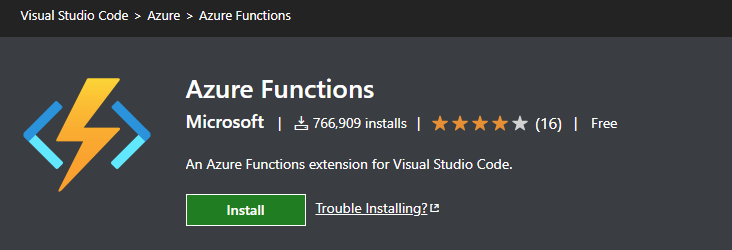

Times are changing and as we transition from Visual Studio Studio to VS Code as well as .net framework to .net core there is some new techniques to learn.  In this article I will show you step by step on how to get started with Azure Functions and create .net core applications that target the Graph and Sharepoint libraries.


download latest .net core https://dotnet.microsoft.com/download

# Visual Studio Code - Azure Functions

There first thing you are going to want to do is add the Azure Functions extension to visual studio code. You can find it [here](https://marketplace.visualstudio.com/items?itemName=ms-azuretools.vscode-azurefunctions) dd



Create Project

Select .net 3.1 core.  At the time of writing .net core 5 is not LTS and does not currently support durable functions. So I opted to stay with .net core 3.1 

2021-03-12-12-20-09.png


skip new function for now. 

2021-03-12-12-21-36.png


2021-03-12-12-23-12.png


For SharePoint
```PowerShell
dotnet add package PnP.Framework
```

For Graph
```PowerShell
dotnet add package Microsoft.Graph
```

dotnet add package Microsoft.Graph
    <PackageReference Include="Microsoft.Azure.WebJobs.Extensions.DurableTask" Version="2.3.1"/>
    <PackageReference Include="Microsoft.Azure.WebJobs.Extensions.Storage" Version="3.0.10"/>
    <PackageReference Include="Microsoft.Azure.Functions.Extensions" Version="1.1.0"/>


"AzureWebJobsStorage": "UseDevelopmentStorage=true",

https://docs.microsoft.com/en-us/azure/storage/common/storage-use-emulator


update localsettingsjson ,   "Host": {     "LocalHttpPort": 7071,     "CORS": "*"   }


