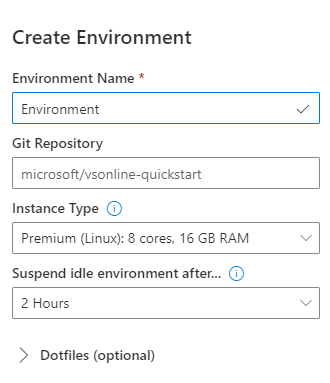
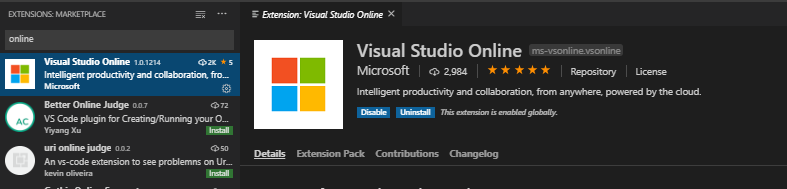
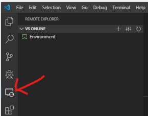
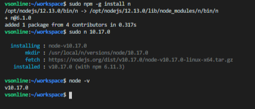
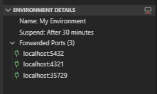

Visual Studio Online is a new service that is currently in public preview. It describes itself as "Cloud-powered dev environments accessible from anywhere". 

Basically you create a remote environment (currently linux but windows comming as well) from the portal or directly from VSCode and in minutes you are up and running. You need an azure subscription as it will create a resource in azure. 

For more information visit https://online.visualstudio.com


With the release of Visual Studio Online we now have a easy way to develop SPFx solutions in an isolated linux environment easily. There are several advantages to this. 

* Node.js projects like SPFx solutions are disk heavy. Building your solution is up to 2X faster on linux due to the diferences in the file system. My current project took 20 seconds to build on my windows maching and was building in about 8 seconds in the remote linux environment.
* Switch easily between projects with different environment versions without conflicts
* All you need is a browser or a computer with VSCode and your set. 

# Lets get started

### Creating Your Environment

Login to https://online.visualstudio.com/environments and click on the Create Environment button. I've tried both standard and premium and I have not noticed any major performance differences so standard is enouph. Paste in your git repo and your code will be awiting for you. 




### Installing the Visual Studio Online Extension

While you can use VSCode directly in the browser, I still prefer the client verison of VSCode. Install the "Visual Studio Online" extension in VSCode.



You should now be able to find an icon on the left bar. When you are logged in you will be able to see your environments here. You can even create a new environment without having to log into Visual Studio Online in the browser. From here you can connect to your environment. You can even suspend or delete environments. 



### Prepare the environment for SPFx Development

At the time of this writting the default the node version is 12.*. This version is not supported with SPFx and we will have to downgrade. Check out the documents to set up your SPFx environment below to get the currently supported version. 

https://docs.microsoft.com/en-us/sharepoint/dev/spfx/set-up-your-development-environment?WT.mc_id=DOP-MVP-5003345

First thing you will want to do is open a new terminal window. First thing e need to do is downgrade node.js. Execute the following commands.


"n" is some sort of node version manager. This needs to be installed and run with elevated privlages so we will use the sudo command.

```cmd
  sudo npm -g install n
```

this command will downgrade node.js to 10.17.0 (or whatever the current supported version might be)
```cmd
  sudo n 10.17.0
```

Below you can see some output from my terminal



Next install yo and gulp 
```cmd
npm install -g yo gulp
```

And finally install the Yeoman SharePoint generator
```cmd
npm install -g @microsoft/generator-sharepoint
```

### Forward some ports

Now before we do something crazy like create a SPFx project and run it we will need to forward some ports so it will run properly on the desktop. In the environment details under the Visual Studio Online extension, add the following ports

* 5432 - for the local workbench
* 4321 - your bundled js
* 35729 - live reload



### The SPFx Project

We are now ready to create the SPFx project. Or if your files are alredy cloned its just to run the npm install command otherwise create a new project.

```cmd
yo @microsoft/sharepoint
```

There are a few things left to take care of. Once your project is ready then you are going to want to do a gulp serve. You will notice that no workbench will appear. Just navigate to https://localhost:5432/workbench and you will have your local workbench. Extension page urls will also not work and you will need to install your extension in SharePoint using gulp package-solution without the --ship command to point to your localhost. 

The second thing you will encounter is that your browser will not trust the certificat. You will need to save the certificate to a file and import it to your local machines "Trust Root Certification Authorities" store. There are lots of guides on google (or Bing). Reload your webpage the the certificate warning will be gone.


 


