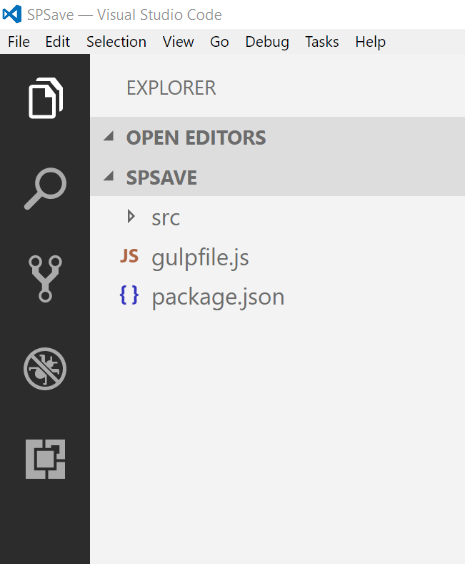
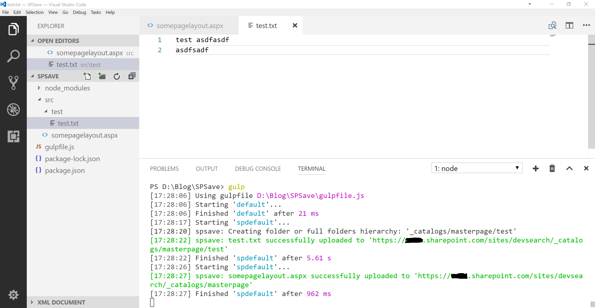

Even with recent changes to SharePoint development we still often need to upload files to SharePoint. I have been using [Visual Studio Code](https://code.visualstudio.com/) and [Node.js (LTS Version)](https://nodejs.org/en/) to automate the uploading of files to SharePoint.

The advantages of using this method is that its fast and easy to set up. When you edit the files it automatically uploads them to SharePoint within seconds. This speeds up development drastically especially if you are one of those drag and drop developers. It also gives you the ability to store and update your code in a git repository. You can also integrate this in a spfx solution (see final thoughts). 

If you are new to node.js and gulp this is an excellent way to play around with it and see how it works. 

To make this work we will use several gulp packages:

#### [gulp-spsave](https://www.npmjs.com/package/gulp-spsave)
Uploads Files to SharePoint

#### [gulp-cached](https://github.com/contra/gulp-cached)
Creates an in-memory cache of your files. It makes sure you only upload the files you change. This is especially useful if you have many files in your project. 

#### gulp-watch](gulp-watch)
Watches folders for changes. This combined with gulp-cached prevents uploading all files in the folder when only a change on a single file is made.  


### Lets get it working
1. Create a new folder somewhere on your computer   
2. Open the folder with VS Code
3. Add a file called gulpfile.js
3. Add another file called package.json
4. Create a folder called src

Your editor should now look like this




Now add the following code to your files

**package.json contents**
```json
{
  "devDependencies": {
    "gulp": "^3.9.1",
    "gulp-cached": "^1.1.1",
    "gulp-changed": "^1.3.2",
    "gulp-spsave": "^3.0.0",
    "gulp-watch": "^4.3.11"
  }
}

```


**gulpfile.js contents**
```js
  
var gulp = require('gulp')
var spsave = require('gulp-spsave')
var watch = require('gulp-watch')
var cached = require('gulp-cached');

var coreOptions = {
    siteUrl: 'https://tenant.sharepoint.com/sites/yoursite',
    notification: true,
    // path to document library or in this case the master pages gallery
    folder: "_catalogs/masterpage/Display Templates/", 
    flatten: false

};
var creds = {
    username: 'user@example.com',
    password: 'your password'
};


gulp.task('spdefault', function() {
    // runs the spsave gulp command on only files the have 
    // changed in the cached files
    return gulp.src('src/**')
        .pipe(cached('spFiles'))
        .pipe(spsave(coreOptions, creds));     
});


gulp.task('default', function() {
    // create an initial in-memory cache of files
    gulp.src('src/**')
    .pipe(cached('spFiles'));
    
    // watch the src folder for any changes of the files
    gulp.watch(['./src/**'], ['spdefault']);
});
```

Once you got that in place open a command line and make sure you are in the same directory as the package.json. Enter "npm install" into the command line to install all the node packages that are listed in your package.json file
```cmd
npm install
```
Now its time to add some files to the "src" folder. The gulp tasks will watch this folder for any changes in the files. For this example i added a file called somepagelayout.aspx as well as a test folder with a test.txt file. 

Finally make sure you update the credentials and url in the gulpfile.js and enter "gulp default" into your command line. This will start your default gulp task in your gulpfile.js.

```cmd
gulp default
```
Now when you make changes to your files in the src folder the files will automatically be uploaded to SharePoint usually within a second or two. There is no need to rerun your gulp task as it is constantly watching the src folder for changes. If you want to stop the program just enter "ctrl + C" in your console to terminate it.

And thats it.. Happy Coding !!




### Final Thoughts

- You can easily add additional gulp tasks to the gulpfile.js to deploy to different environments. Example gulp deploy-to-production
- If you are using a git repository to keep your code safe you may want to add a .gitignore file to your file structure and add the node_modules directory to it so they are excluded. These files are added when you run the npm install command.   
- Check out the [spsave](https://www.npmjs.com/package/spsave) documentation and explore other ways you can use it. 
- Want to upload to an azure cdn instead. have a look at [gulp-deploy-azure-cdn](https://github.com/bestander/gulp-deploy-azure-cdn) 
-  [Integrate gulp tasks in SharePoint Framework toolchain](https://dev.office.com/sharepoint/docs/spfx/toolchain/integrate-gulp-tasks-in-build-pipeline) so you have all your code in one solution
- Combine with [gulp-typescript](https://www.npmjs.com/package/gulp-typescript) to use TypeScript files.